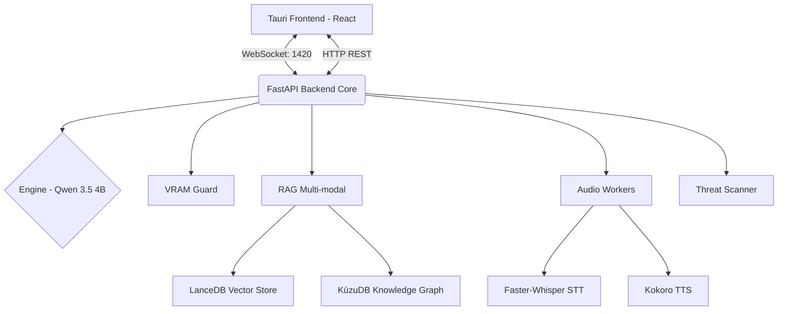

# Project Trinity Architecture

HackT operates under **Project Trinity**, a zero-cloud, privacy-first architectural pattern that ensures all data processing, inference, and memory storage occurs locally on your hardware.

## System Components

### 1. Frontend: Tauri + React
The frontend is a lightweight, responsive desktop application built with React, Vite, and Tauri.
- **State Management**: Uses Zustand for global state, tracking threat levels and user sessions.
- **Boot Sequence**: Includes a reactive 45s model loading timeout to accommodate slow disk reads on low-spec systems.
- **Code Diff Modal**: Intercepts parsed AST threat detections from the backend and provides a single-click diff application interface.

### 2. Backend Core: FastAPI Daemon
A highly modular Python 3.11 backend serving as the orchestrator.
- **VRAM Guard**: Monitors real-time GPU memory pressure using `pynvml`. When memory exceeds 90%, it triggers a graceful degradation to CPU fallback or unloads idle models.
- **Signal Handling**: Async-aware handlers ensure safe tensor deallocation during `SIGTERM`/`SIGINT`.

### 3. Inference Engine
Local LLM capabilities are powered by `llama-cpp-python` running **Qwen 3.5 4B** (`q4_k_m` quantized).
- **Token Clamping**: Hard limits set at 510 tokens for C++ memory safety.
- **Thread Control**: Configurable CPU multi-threading (default 4 threads, batch size 512).

### 4. RAG: Vector + Graph
Combines two local databases for semantic and structural context.
- **LanceDB**: Stores vector embeddings (`nomic-embed-text-v1.5`) for rapid semantic similarity search.
- **KùzuDB**: Maps structural code dependencies (classes, functions, imports) in a graph format.

### 5. Multi-modal Inputs
- **Vision**: Florence-2 Base processes OCR and screen captures (Passive Mode).
- **Audio**: Isolated thread workers for Whisper (STT) and Kokoro (TTS) to prevent Python GIL blocking during inference.
